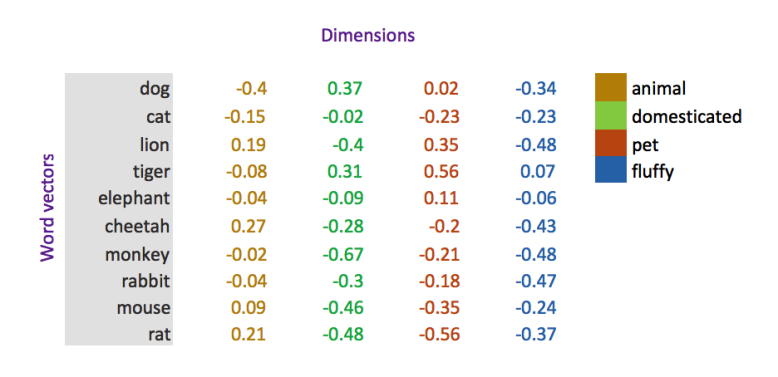

### Word representation in machine learning problem

1. Localist representation: One-hot encoding vector, a vector of zeros,
   excepts the position where the target is in the word pool.
2. **Words vector**: word embeddings or word representations, which are
   distributed representation. Captures word meanings by a vector of
   real valued numbers (as opposed to dummy numbers) where each point
   captures a dimension of the word’s meaning and where semantically
   similar words have similar vectors.

   

   Advantage:
   - Relatively smaller dimension
   - similar words as similar word vectors, and can be measured
     mathematically.
   - support mathematical operation e.g. King - Man + Women = Queen

### How to construct world representation?

#### Word2vec

$ \int_a $

\int_a

