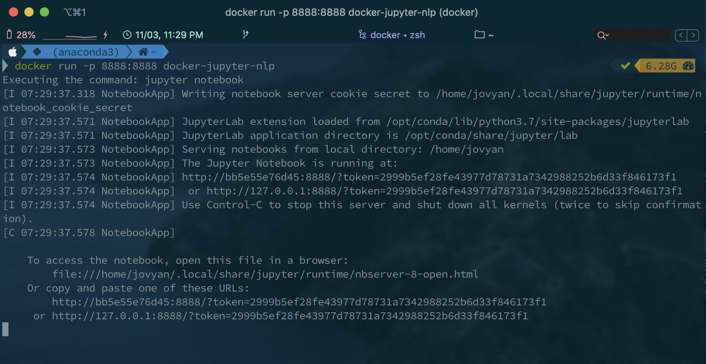
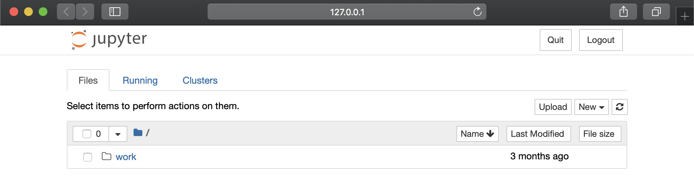
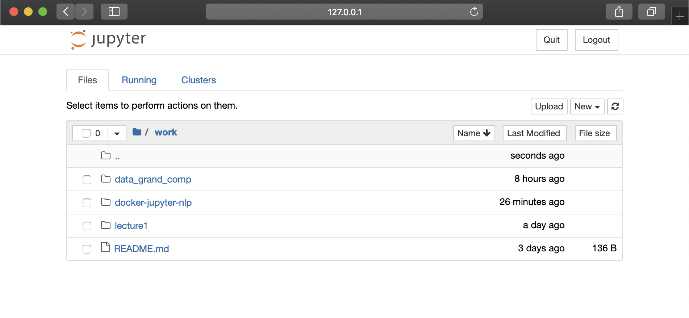

# Jupyter-nlp 简易实用指南

## 写在最前面

如果不想看为什么要用Docker，Doccker的原理，其实剩下的就很简单，根据第二部安装了Docker之后，然后只需要在第三部里面选择一行code在命令行窗口运行就可以了。

## 1. 什么是Docker，为什么要用Docker，怎么安装Docker？

长话短说版本：
> 台式电脑是Windows PC，笔记本式Mac，每次配置环境麻烦不堪，而且一不小心一段操作猛如虎还会把系统本身的python和anaconda弄混，一两个项目倒还好，项目一多很容易把系统弄乱，渐渐的系统也会运行的变慢。
> 后来听说了Docker，就让一切都变得美好了起来，Docker可以理解为一个更为简易，轻便的虚拟机，但是不如虚拟机那么臃肿，启动起来也很方便。这里简单的介绍一些概念：
>
> 1. Container（容器）：每一个container就相当于一个小型的虚拟系统，每个container里面有包含要在里面跑的程序（服务）的所有需要的配置或者辅助程序。Docker container之所以被称作轻量级的虚拟机，原因就是在Docker container里面只包括要在这个container里面需要跑的程序的必要辅助，并不需要安装其他没有必要的服务或者程序，所以就不如虚拟机那么臃肿。
>
> 2. Image（映像）：可以理解为系统配置的图纸，映像里面定义了一个小型的“虚拟系统”里面都预装了哪些服务。如果面向对象编程程序设计的概念来做类比的话。Docker Image相当于类（Class）的定义，而Container则相当于对象（Object/Instance of Class）。所以就相当于通过每个Image可以部署多个Containers。
> 
> 3. Dockerfile: 定义Image的文件。Image里面需要安装什么样的辅助服务，定义什么样的环境变量等等。
> 
> 4. 基本的流程：编写Dockerfile -> 通过docker build 指令开始构建Image -> 通过docker run 开始一个container 然后就可以用里面run的服务了。

看到现在你可能会好奇，这和我有什么关系，我为什么要非这么大劲弄Docker，而不是直接几行指令构建conda environment来搞定。好的，事情是这样的。如果只是简单的项目而且只是平常用的几个package，那么conda env 完全够用。**但是**， 事情有时候并不总像想象那样顺利，因为有的时候不同的系统配置/环境，会导致有些时候装一些package的时候会出现各种各样的问题。这时候Docker就派上用场了，因为Docker里面的内核是Unix，很多package在linux中的安装都是很顺利的，不需要过多的麻烦。同时，Docker只用配置一次，然后可以在Windows PC或者Mac或者Linux里面用，因为我们索要跑的服务（python或者jupyter）都是在contianer里面，所以根本不用再担心为服务配置环境的问题，因为都已经在Image里面配置好了。

_其实画了这好几段来极为潦草的介绍Docker主要是想让大家大概了解一下Docker然后为什么对我们有帮助。其实大多时候大家基本上都不用自己写Image，直接用这个folder里面的已经配置好的Image就好了，下面也会提到如何个性化Docker的配置，例如安装其他需要的python packages。_

接下来是长话长说版本：
- https://yeasy.gitbooks.io/docker_practice/introduction/what.html
- https://www.docker.com/

## 2. 如何安装

这是所有一切的开始，必须根据自己用的系统安装相应的Docker程序

> [Docker for Windows 10](https://yeasy.gitbooks.io/docker_practice/install/windows.html)
> 
> [Docker for Mac](https://yeasy.gitbooks.io/docker_practice/install/mac.html)
> 
> [Docker for Ubuntu](https://yeasy.gitbooks.io/docker_practice/install/ubuntu.html)

安装了之后打开终端窗口（或者windows里面的命令行窗口）敲入 `docker -v`, 如果看到类似于下面的输出值，就是成功了。
```shell
>>> docker -v
Docker version 19.03.4, build 9013bf5
```

## 3. 用我们自己的docker container来跑Jupyter notebook

3.1. 请大家clone这个repo 或者下载了之后只把这个文件夹里面的 **`Dockerfile`** 和 **`requirements.txt`** 拿出来单独的放到 **同一个文件夹** 里。

3.2. 根据Dockerfile里面的配置定义构建映像（这个我们只需要跑一次就好，不用以后每次都跑）

   ```shell
   >>> cd path/to/Dockerfile
   >>> docker build . -t docker-jupyter-nlp
   ```

我们逐行解我这里做了什么：

`cd path/to/Dockerfile` 就是改变路径，把路径变成Dockerfile所在的文件夹。`cd` 是Mac上面的改变文件夹的指令，请Windows用户百度/google相对应的指令。`path/to/Dockerfile` 就是Dockerfile所在的文件夹。

`docker build . -t docker-jupyter-nlp` 首先 `docker build` 是docker的command line指令，后面跟着的`.` 是告诉docker在目前所在的文件夹里面去找Dockerfile，`-t docker-jupyter-nlp` 是告诉docker，把我现在正在构建的映像命名（标签）为 `docker-jupyter-nlp`。这个名字可以是自己起的任何名字，只要在下面一步对应上就好。`-t` 是 `--tag` 的缩写。

这里会花上几分钟来创建我们这个映像，创建好了之后，敲入下面指令就能看到刚刚创建的映像了

```shell
>>> docker image ls
REPOSITORY  TAG  IMAGE ID  CREATED  SIZE
docker-jupyter-nlp  latest  ba76398df579  2 hours ago  4.98GB
```
这里 `ls` 指的是 `list` 列举出来目前系统上已经有的映像。之后我们就可以直接用已经构建好的映像部署容器（Container）了。

3.3. 下面我会给大家介绍几种不同的用法，大家按需选择，从最简单开始。

1. `docker run -p 8888:8888 docker-jupyter-nlp`

    这里 `docker-jupyter-nlp` 是不是很熟悉，就是我们上一步创建的映像的名字，然后 `-p 8888:8888` 是把我们localhost的port 8888 映射到docker container（容器）里面的 port 8888，这样我们就可以在后面通过localhost(127.0.0.1)的 port 8888 看到jupyter notebook的用户界面了。结果如下图

    

    然后就只用把terminal中的这个 `http://127.0.0.1:8888/?token=2999b5ef28fe43977d78731a7342988252b6d33f846173f1` 链接复制到浏览器里面就可以使用jupyter notebook了。

    

    这个jupyter notebook是在container里面run的，里面已经预装了sklearn, pandas, numpy, gensim 等常见以及我们现在第一个达观杯比赛模版code里面用到的所有package。后面我会给大家介绍如何安装其他的package。是不是很简单 :)。

    但是呢，大家肯定会有一个疑问我进去之后可以创建jupyter notebook，可以用terminal，但是我创建的ipynb文件或者py文件后者所有我在这里面创建的文件我怎么找到呢？或者我怎么把我系统里面的文件file放到jupyter notebook的用户界面中呢？我怎么看不到我自己的文件呢？好问题，想之前给大家介绍的，因为我们这个服务（jupyter notebook）是在docker container（容器）里面部署的，所以我们所有创建的文件都是在这个虚拟的轻量级虚拟系统中的，虽然这个虚拟系统是在我们电脑的主机上host的，但是要直接找到我们创建的文件是要话一定功夫，因为默认储存这些文件的地方在Docker 安装路径里面的某个临时位置，也就是说，如果以后某个时候我们把这个docker容器给删了，那我们的文件也就再也找不到了。

    大家不用慌，docker为我们提供了把docker容器里面的文件夹映射到我们主机上文件夹的方法，他们叫做persistent data，也就是把主机上的某个文件夹和docker container里面的某一个文件夹链接起来，这样我们在container里面和我们主机上都可以看到或者操作这个文件夹里面的所有文件。而且就算以后这个docker container被我们删了，这些文件还都存在。如何映射这个 persistent data的文件夹，请看下一步。

2. ```shell 
   docker run -p 8888:8888 -v path/to/folder/on/host:/home/jovyan/work docker-jupyter-nlp
    ```

    和刚刚的指令比起来，我们就多了一小部分 `-v path/to/folder/on/host:/home/jovyan/work` 这里 `-v` 是`--volume` 的缩写，后面冒号前面的部分是主机上的某个文件夹 `path/to/folder/on/host`， 而冒号后面的一部分是在container里面映射到的文件夹，**这个不需要改动，也不能改动**。比如说如果我想把我桌面上的一个叫做 `files` 的文件夹映射进去，我就会写 `-v Users/zhengmingsong/Desktop/files:/home/jovyan/work`。然后就是敲回车，把输出的网址贴到浏览器，就可以在 **work** 文件夹里面看到你项目文件夹里面的文件啦，例如:

    

    然后，然后就可以想平常该怎么用notebook怎么用notebook啦！

    如果等大家work完想要关闭jupyter的时候呢，就像平常我们用jupyter一样，除了关闭浏览器之外也要在terminal里面用 `Ctrl+C` 来退出container。

    然后为了宝成我们的container是完全关闭的，大家可以用下面指令

    ```shell
    >>>docker container ls
    CONTAINER ID  IMAGE  COMMAND  CREATED   STATUS  PORTS  NAMES
    e77b74d91c2d  docker-jupyter-nlp  "tini -g -- /bin/sh …"  5 seconds ago  Up 3 seconds  0.0.0.0:8888->8888/tcp  romantic_banzai
    ```

    `docker container ls` 这个指令是列举出来目前系统里面在运行的docker 容器（containers）如上面所示，如果发现有正在运行的我们刚刚想要关闭的image但是没有被正确关闭的cotainer呢，我们可以用 `docker stop e77b74d91c2d`, 这里 `e77b74d91c2d` 是系统自己给我们这个container分配的id名字，直接从 `docker container ls` 的输出值里面复制粘贴就好。


好了，基本上以上这些就是一些docker的基本用法，妈妈再也不用担心你因为系统原因花几个小时装一个什么package了。

## 4. 个性化安装其他的 package/library

**Last but not the least**，有些同学可能会闻如果我用的package你这里没有怎么办，我这里有两个方法帮助你安装我这个映像里面没有预装的包。

1. 在Jupyter notebook 里面创建新的 terminal，如下图所示

    

    优点：方便，随时用随时装。
    
    缺点：不会被记录下来，每次关了docker 容器再开始的时候都要装一遍，因为我们没有在docker 映像（Image）里面定义，所以不会被记录下来。

    如果不想每次开关容器之后都重复的安装的话，请看下面的方法。

2. 首先，在Dockerfile同一个文件夹里面的 `requirement.txt` 里面把想要装的package都列进去。

    然后重复3.2中的指令，重新构建docker 映像：

    ```shell
   >>> cd path/to/Dockerfile
   >>> docker build . -t docker-jupyter-nlp
   ```

   这样，我们所需要的package都被安装到了映像里面，每次启动docker 容器（container）的时候里面都会有新安装的package。


这次就先给大家介绍这些基本的用法，希望能给大家带来帮助，之后如果大家感兴趣等我有时间我会给大家介绍更多玩儿法，以及解释Dockerfile里面每一行都在做什么事情。

我也会不定期的更新这个[Markdown文件]()做更多解释。

