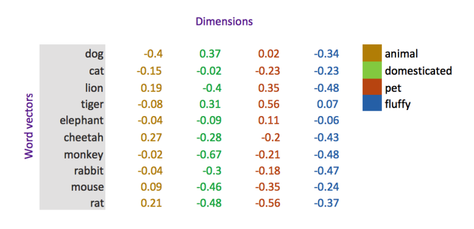

### Word representation in machine learning problem

1. Localist representation: One-hot encoding vector, a vector of zeros,
   excepts the position where the target is in the word pool.
2. **Words vector**: word embeddings or word representations, which are
   distributed representation. Captures word meanings by a vector of
   real valued numbers (as opposed to dummy numbers) where each point
   captures a dimension of the word’s meaning and where semantically
   similar words have similar vectors.

   

   Advantage:

   - Relatively smaller dimension
   - similar words as similar word vectors, and can be measured
     mathematically.
   - support mathematical operation e.g. King - Man + Women = Queen

### How to construct word vector?

#### SVD method

1. Construct a matrix X:
   - Word to document matrix
   - Window based Co-occurrence Matrix

2. Apply $X = USV^T$

3. Select $k$ columns of $U$.

disadvantage: computational intensive $\mathcal{O}(N^2)$

#### Word2vec

> Likelihood function:  
> $$ Likelihood
> =L(\theta)=\prod_{t=1}^{T}\prod_{-m\leq j \leq m ; j \ne 0} P(w_{t+j}|> w_t; \theta) $$

> Objective function:
> $$J(\theta) = -\frac{1}{T} \log L(\theta) = -\frac{1}{T} \sum_{t=1}^{T}\sum_{-m \leq j \leq m; j\ne 0} \log P(w_{t+j} |w_t ; \theta) $$
> where
> $$ P(w_{t+j} | w_t ; \theta) = Softmax(\mu_o^T v_c) = \frac{e^{\mu_o^T v_c}}{\sum_{w\in W} e^{\mu_w^T v_c}} $$
> then we can write:
> $$ J(\theta) = -\frac{1}{T} \sum_{t=1}^{T}\sum_{o\in V} \log \frac{e^{\mu_o^T v_c}}{\sum_{w\in W} e^{\mu_w^T v_c}}$$
> find the derivative 
> $$\frac{\partial J}{\partial v_c} =\frac{\partial}{\partial v_c} -\frac{1}{T} \sum_{t=1}^{T}\sum_{o\in V} [u_o^T v_c - \log \sum_{w\in W}e^{u_w^T v_c}]$$
> $$\ =-\frac{1}{T} \sum_{t=1}^{T}\sum_{o\in V} [u_o - \sum_{w\in W}P(u_o|v_c)u_w]$$
> $$\frac{\partial J}{\partial u_o} =\frac{\partial}{\partial u_o} -\frac{1}{T} \sum_{t=1}^{T}\sum_{o\in V} [u_o^T v_c - \log \sum_{w\in W}e^{u_w^T v_c}]$$
> $$\ =-\frac{1}{T} \sum_{t=1}^{T}[(1-P(u_o|v_c))v_c]$$

A very good source that explains word2vec in very details can be found [here](http://www.claudiobellei.com/2018/01/06/backprop-word2vec/#)